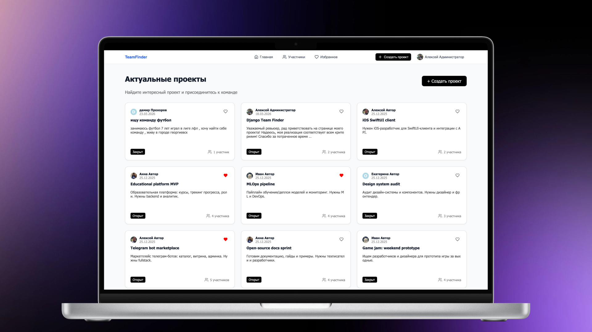

<div align="center">

# TeamFinder

<em>A platform for developers, designers, and other specialists to find projects and teams</em>

<br>


<br>

<a href="https://team-finder.ru"><strong>🌐 Team Finder Live</strong></a>
&nbsp; &nbsp;
<a href="docs/locale/README.ru.md"><strong>🇷🇺 Русский (Ru)</strong></a>
&nbsp; &nbsp;
<a href="docs/review/REVIEW.md"><strong>💻 For Review</strong></a>

</div>

---

## Table of Contents

- [About](#about)
- [Key Features](#key-features)
- [Technical Highlights](#technical-highlights)
- [Image Sizes](#image-sizes)
- [Local Development](#local-development)
- [Production Deployment](#production-deployment)

---

## About

**TeamFinder** is a digital collaboration ecosystem built to help developers, designers, and other specialists turn
pet-project ideas into reality. The platform makes it easy to find projects to join or to build a team around your own
idea.

> This version of the project is a final thesis and fully implements **Option 1** of the technical specification —
> Favorites system and advanced filtering.

---

## Key Features

<table>
<tr>
<td width="50%" valign="top">

**🚀 Project Management**

Full lifecycle for creating and managing projects. Flexible status switching: from actively looking for a team (**Open
**) to successful completion or closing the search (**Closed**).

</td>
<td width="50%" valign="top">

**🔍 Search & Navigation**

- **Project feed** — chronological feed with pagination (12 projects per page).
- **Developer catalog** — with quick access to portfolios and contacts.

</td>
</tr>
<tr>
<td width="50%" valign="top">

**💻 Team Interaction**

- **Quick join** — Join/Leave mechanics for instant participation in projects.
- **Team roster** — dedicated interface for monitoring members in real time.

</td>
<td width="50%" valign="top">

**⭐ Personalization & Filters**

- **Favorites** — personal list for tracking projects by category.
- **Smart filtering** in the user catalog:
    - Authors of favorited projects
    - Authors of projects I participate in
    - Users who liked my projects
    - Members of my projects

</td>
</tr>
<tr>
<td width="50%" valign="top">

**👤 Profiles & Contacts**

- **Avatars** — auto-generated from email on registration, with regeneration and custom upload support.
- **Profiles** — contact details (GitHub, Email, Phone), links to user and project GitHub pages.

</td>
<td width="50%" valign="top">

**🛡️ Security & Access**

- **Permission system** — three levels: Guest / Authenticated user / Admin.
- **Account management** — password change, secure email-based authentication.

</td>
</tr>
</table>

---



---

## Technical Highlights

**TeamFinder** is built using modern best practices for developer experience, performance, and maximum security.

<details>
<summary><strong>🏗️ Modern Architecture</strong></summary>
<br>

- **Architecture** — modern Django application architecture using the services and selectors pattern for logic
  separation.
- **Services** — isolated business logic. Easy to reuse across apps, edit, and configure.
- **Selectors** — data retrieval layer. Easy to use across apps, straightforward to optimize and edit.
- **Core** — shared application logic, infrastructure, security decisions, and a unified interface for use across apps.
- **Middlewares** — custom security, metrics, and logic middlewares.

</details>

<details>
<summary><strong>🔒 Strict Typing</strong></summary>
<br>

- **Types** — code is strictly typed and adapted for Django using `django-stubs`. Type imports are optimized with
  `typing.TYPE_CHECKING`.
- **Checking** — `pyright` performs static analysis, configured for `Django`.
- **Pydantic** — `pydantic-settings` for the main config. It is the single source of truth for the entire project,
  providing safety, strict typing, and validation. Service settings validation is implemented using
  `pydantic.BaseModel`.

</details>

<details>
<summary><strong>⚡ High Performance</strong></summary>
<br>

- **Optimized DB access** — minimal number of queries per page or action. Part of the logic is pushed to the database
  side for speed. `Debug-toolbar` is enabled during local development in `DEBUG` mode. **Fewer than 5 (1–4) DB queries
  per page/endpoint.**
- **Redis** — extensive use for session management, rate limiting, brute-force protection, and metrics.

</details>

<details>
<summary><strong>🛠️ Developer Experience</strong></summary>
<br>

- **uv** — fast, secure, and efficient dependency management via `uv.lock`. An industry standard that speeds up project
  deployment and image builds by orders of magnitude.
- **Ruff** — blazing-fast linting and code formatting. Fully configured for Django in `pyproject.toml`. `Black`-style
  formatting.
- **Testing** — full test coverage using `pytest` and `unittest`. Tests are completely isolated from real `Redis` and
  `PostgreSQL` instances, use a dedicated Redis database, leave no files or records behind, and can run without
  environment variables. Plugins, factories, and `sqlite3 in-memory` ensure maximum speed and clean code. **210+ tests
  run in under 5 seconds on first run.**

</details>

<details>
<summary><strong>🛡️ Security</strong></summary>
<br>

- **Brute-force protection** — custom rate limiting and brute-force protection mechanism. Low resource usage thanks to
  `Redis`. Fast and flexible configuration in `team_finder/settings.py`.
- **Nginx** — heavily tuned configuration provides maximum protection against bots, scanners, and DDoS. Over 90% of
  standard bot requests receive a `444` response (instant connection drop). Bad requests never reach Django. Client-side
  caching of media and static files is implemented; clients always receive fresh files since each file gets a hash on
  media creation and during `collectstatic`.
- **HTTPS** — SSL certificate handling, up-to-date ciphers, session caching.
- **Custom paths** — ability to set non-standard paths for the admin panel and healthcheck.

</details>

<details>
<summary><strong>📋 Logging</strong></summary>
<br>

- **Informative** — logging of all user actions. Well-formatted, descriptive log entries.
- **Easy access** — logs are available as Docker volume files and container logs. Separate files are created for each
  log level.
- **Security** — PK is used as the unique identifier in user action logs. This prevents personal data leaks (email,
  phone) and guarantees immutability of the unique identifier.
- **Customization** — log format and level are configurable. Separate log levels can be set for the Django application
  and the database.

</details>

<details>
<summary><strong>🚀 Production Ready</strong></summary>
<br>

- **Automated CI/CD** — `GitHub Actions` pipeline following: Testing → Docker image build and push to `DockerHub` → Copy
  configs to server → Restart application. Triggered on every push to `main`, excluding documentation commits. Secrets
  are stored securely in `Actions secrets`. Caching is used for faster runs.
- **Dockerfile** — fast, lightweight (295 MB), and hardened image. Best practices applied: `uv`, caching, bytecode
  compilation at build time; `Debian`-based layer for compatibility with complex libraries. The main process runs as the
  `django` user; `gosu` handles correct startup and permission management.
- **Docker Compose** — up-to-date `Alpine` service versions. Private networks created; only `Nginx` is exposed
  externally. Services are fully tuned for security and performance.

</details>

<details>
<summary><strong>🎨 Administration</strong></summary>
<br>

- **Jazzmin** — beautiful and informative admin panel at the level of modern dashboards. Custom metric for online user
  count is displayed. See [demo](docs/images/admin-ui.png).
- **Actions** — custom admin actions with broad functionality and full site management.
- **Filters** — large number of filters, including a custom filter for selecting online users.
- **Django commands** — get secure service links via `get_service_links`, generate avatars for a user selection via
  `generate_avatars` with flags.

</details>

<details>
<summary><strong>🎛️ Optimization</strong></summary>
<br>

- **Server** — image built for `Ubuntu 24.04`. Minimum requirements: 1 CPU, 2 GB RAM, 2 GB HDD.
- **Lightweight** — on `Ubuntu 24.04` the full application takes only 650 MB of virtual Docker weight (approximately 900
  MB physical).
- **Minimal RAM usage** — the entire application with three `gunicorn` workers, the OS, and `docker` uses under 1.2 GB
  RAM. See [stats](docs/images/vps-stat.png).

</details>

---

## Image Sizes

| Service    | Image                          |    Size |
|:-----------|:-------------------------------|--------:|
| Nginx      | `nginx:1.29.7-alpine3.23-slim` | 14.8 MB |
| Redis      | `redis:7.4.8-alpine3.21`       | 43.4 MB |
| PostgreSQL | `postgres:17.9-alpine3.23`     |  288 MB |
| Django     | `warrior88888/team-finder-ad`  |  295 MB |

---

## Local Development

### Clone the repository

```bash
git clone git@github.com:warrior88888/team-finder-ad.git
cd team-finder-ad
```

### Quick start (Docker)

The recommended approach — run via `docker compose`, it brings up all services automatically:

```bash
docker compose -f docker-compose.dev.yml up --build
```

---

### Manual Setup

#### Requirements

| Service            | Link                              |
|:-------------------|:----------------------------------|
| Python 3.13        | https://www.python.org/downloads/ |
| uv *(recommended)* | https://docs.astral.sh/uv/        |
| PostgreSQL         | https://www.postgresql.org/       |
| Redis              | https://redis.io/                 |

#### 1. Install dependencies

**With uv (recommended):**

```bash
uv sync
```

**With pip:**

macOS / Linux:

```bash
python3 -m venv .venv && source .venv/bin/activate
pip install -r requirements.txt
```

Windows:

```bash
python -m venv .venv && .venv\Scripts\activate
pip install -r requirements.txt
```

#### 2. Configure environment

```bash
cp .env.example .env
```

Open `.env` and fill it in following the instructions inside the file.

#### 3. Migrations

```bash
python manage.py migrate
```

#### 4. Run the server

```bash
python manage.py runserver
```

#### 5. Demo data *(optional)*

Creates test users with projects — recommended for local development:

```bash
python manage.py loaddata demo_data.json
python manage.py generate_avatars --blank
```

> All users from `demo_data.json` have the password: **`devpass`**

#### 6. Service links *(optional)*

Prints links for quick navigation to the admin panel and healthcheck:

```bash
python manage.py get_service_links
```

---

### Code Quality

```bash
ruff check . --fix   # linting
pyright              # static type checking
pytest               # tests
```

---

### Notes

- `requirements.txt` contains **all** dependencies, including dev.
- `pytest` does not require a `.env` file, but a running Redis instance is needed.
- The `django_app` container has **uv** installed, commands can be called without `uv run`:

```bash
docker exec django_app python manage.py <command>
```

---

## Production Deployment

Deployment is fully automated using **GitHub Actions**. Every push to `main` (excluding documentation commits) triggers
the pipeline:

```
Tests → Build → Deploy → Notify
```

### CI/CD Pipeline Steps

|          Step           | Description                                                                                                                                                      |
|:-----------------------:|:-----------------------------------------------------------------------------------------------------------------------------------------------------------------|
| **1. Latest versions**  | Latest action versions based on **Node.js 24** are used to eliminate warnings.                                                                                   |
|     **2. Testing**      | Environment setup with **Python 3.13** and **uv**. Runs **Ruff** (linting), **Pyright** (static typing), and **Pytest** with a live **Redis** service container. |
| **3. Containerization** | Builds an optimized production image via **Docker Buildx** with GHA caching and publishes it to **DockerHub**.                                                   |
|      **4. Deploy**      | Copy configs to VPS → generate `.env` from GitHub Secrets → `docker compose pull && up -d` → prune old images.                                                   |
|  **5. Notifications**   | Sends success/failure reports with commit messages and author info directly to your **Telegram** bot.                                                            |

### Required GitHub Secrets

Configure the following secrets in the repository: **Settings → Secrets and variables → Actions**

<details>
<summary>Show all secrets</summary>
<br>

| Category          | Secret Key                     | Description                                  |
|:------------------|:-------------------------------|:---------------------------------------------|
| **VPS Access**    | `HOST`, `USER`, `SSH_KEY`      | SSH credentials for the remote server.       |
|                   | `PORT`, `PASSPHRASE`           | SSH port and key passphrase.                 |
| **Docker**        | `DOCKER_USERNAME`              | DockerHub username.                          |
|                   | `DOCKER_PASSWORD`              | DockerHub personal access token or password. |
| **Django Core**   | `TF__DJANGO__SECRET_KEY`       | Production key for security and signing.     |
|                   | `TF__DJANGO__DOMAIN`           | Production domain (e.g. `team-finder.ru`).   |
|                   | `TF__DJANGO__ADMIN_PATH`       | Custom URL path for the Django Admin panel.  |
|                   | `TF__DJANGO__HEALTHCHECK_PATH` | Internal path for service health monitoring. |
| **Database**      | `TF__POSTGRES__DB`             | PostgreSQL database name.                    |
|                   | `TF__POSTGRES__USER`           | PostgreSQL username.                         |
|                   | `TF__POSTGRES__PASSWORD`       | PostgreSQL password (properly escaped).      |
|                   | `TF__POSTGRES__PORT`           | PostgreSQL connection port (default 5432).   |
| **Redis**         | `TF__REDIS__PASSWORD`          | Redis authentication password.               |
|                   | `TF__REDIS__PORT`              | Redis connection port (default 6379).        |
|                   | `TF__REDIS__DEFAULT_DB`        | Redis database index (e.g. 0).               |
| **Logging**       | `TF__LOG__FORMAT`              | Application log structural format.           |
|                   | `TF__LOG__LEVEL`               | Global log level (e.g. `INFO`).              |
|                   | `TF__LOG__DB_LEVEL`            | Log level for database queries.              |
|                   | `TF__LOG__DJANGO_LEVEL`        | Log level for Django internals.              |
| **Notifications** | `TELEGRAM_TO`                  | Telegram Chat ID for deployment reports.     |
|                   | `TELEGRAM_TOKEN`               | Telegram Bot Token.                          |

</details>

---

<div align="center">
  <sub>Made with ❤️ · <a href="https://team-finder.ru">team-finder.ru</a></sub>
</div>
